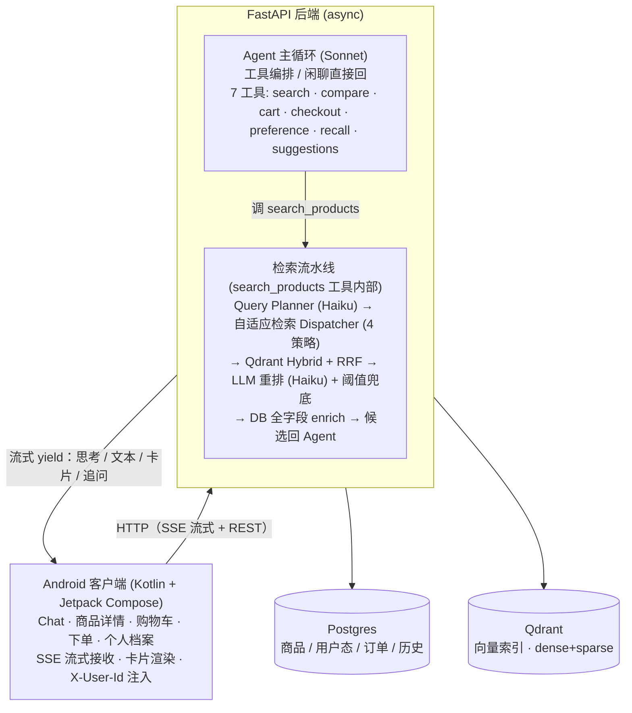

# ShopMind 设计文档

> 基于 RAG 的电商导购 AI Agent — 系统架构、技术选型与关键工程解法

## 文档导读

本文讲 ShopMind"怎么设计的、为什么这么设计"：RAG 检索链路、大模型导购策略，以及防幻觉、对话智能等关键问题的解法。部署与上手见[《说明文档》（README）](README_CN.md)。

---

## 目录

1. [项目概述](#1-项目概述)
2. [系统架构](#2-系统架构)
3. [技术栈与运行环境](#3-技术栈与运行环境)
4. [关键技术方案](#4-关键技术方案)
5. [数据设计](#5-数据设计)
6. [目录结构](#6-目录结构)
7. [配置说明](#7-配置说明)
8. [工程质量保障](#8-工程质量保障)
9. [关键问题与解决方案 / V2 演进](#9-关键问题与解决方案--v2-演进)
10. [附录 A：search_products 工具内部流程（实现细节）](#附录-asearch_products-工具内部流程实现细节)

---

## 1. 项目概述

**ShopMind 是一个基于 RAG（检索增强生成）的电商导购 AI Agent。** 用户用自然语言描述需求（"1000 以内的运动鞋""帮我对比这两款"），系统理解意图、从真实商品库检索、给出**有依据、不编造**的推荐，并支持在对话里直接完成加购与下单。

### 1.1 解决什么问题

传统电商搜索是"关键词匹配 + 人工筛选"，用户得自己翻列表、比参数。直接套一个通用大模型又有两个致命问题：会一本正经编造不存在的商品/参数（幻觉），且无法接入真实库存与下单。ShopMind 的定位就在两者之间：用 LLM 的对话理解力，约束在真实商品数据之上，做诚实、闭环的导购。

### 1.2 对应赛题加分项

| 方向 | 本项目落地 |
|---|---|
| **业务闭环** | 对话内加购物车 → 下单结算 → 订单确认，全程卡片化 |
| **对话智能** | 多轮上下文、反选（排除品牌/价格上限）、商品对比、个性化重排 |
| **诚实推荐 / 无幻觉** | 三道防幻觉铁律 + 评论双面平衡摘要（优点与注意点都给） |
| 多模态 | **V1 聚焦文本链路**；图像检索为 V2 预留（见 §9） |

> **无幻觉是赛题第一减分项**，也是本项目最核心的设计约束——架构里很多取舍（SQL 硬过滤、阈值兜底、事实只走 DB）都是为它服务的。

---

## 2. 系统架构

### 2.1 整体架构



> 外部服务：Claude（Sonnet 主对话 / Haiku 规划·重排）· Gemini Embedding · 火山引擎 Doubao（仅离线评测 Judge，非运行时依赖）。

### 2.2 一次对话的完整链路

以"我想买一双 1000 以内的运动鞋"为例，串起整条故事线。**关键：Agent（Sonnet）是唯一编排者**——它先判断要不要找商品，要找才调 `search_products` 工具，Planner 与整条检索流水线都跑在这个工具内部：

1. **Agent 决策（Sonnet）**：装载用户档案 + 会话态 + 最近 N 轮历史，判断这是找商品的请求（若是闲聊/致谢则直接回，不调任何工具），决定调 `search_products`。
2. **意图理解（Planner，Haiku，工具内）**：把 query + 上下文 → 结构化 `QueryPlan`，判定查询类型，抽出可被 SQL 过滤的**硬约束**（类目=运动鞋、price_max=1000）。
3. **自适应检索（Dispatcher，工具内）**：本例有硬约束 → 走 `filtered_semantic`：先 SQL 按硬约束**精确过滤**出 product_id 白名单（价格 ≤1000 且类目=运动鞋，不交给 LLM），再在白名单内做 dense + sparse 混合检索（Qdrant 原生 RRF 融合）→ 按 product_id 聚合取最高分。
4. **重排兜底（Reranker，Haiku，工具内）**：LLM 逐个打相关性分，**最高分低于阈值就返回空**，触发"没找到符合的"文案——**绝不硬推不相关商品**；过阈值的合格集内再按用户画像做一轮确定性（规则、非 LLM）的 fit 微调（只排序、不淘汰）。全字段从 DB enrich 后回传 Agent。
5. **Agent 组织回答（Sonnet）**：拿到候选商品，组织自然语言。商品的任何属性（价格/成分/库存）**只引用工具返回的结构化字段**，不读检索原文编造。
6. **流式回客户端（SSE）**：思考过程、文本、商品卡片、推荐追问，边生成边推送；商品卡片是精简 schema，点开详情走独立 REST。

### 2.3 核心设计原则

| 原则 | 含义 | 体现 |
|---|---|---|
| **防幻觉优先** | 宁可少答、不可错答 | 三道铁律（§4.2） |
| **接口可替换** | 易变组件抽 `Protocol`，换实现不动业务 | Embedder / Reranker / Strategy / Cache |
| **配置集中** | 魔法数字全进 `config.py`，业务代码不写死 | §7 |
| **多用户隔离** | 所有用户态查询带 `user_id`，严防越权 | §4.3 + §5 |
| **不过度设计** | V2 能力只在文档作为演进方向，不在 V1 实施 | §9 |

---

## 3. 技术栈与运行环境

### 3.1 技术栈

| 层 | 选型 |
|---|---|
| **后端** | Python 3.10+ · FastAPI（async）· SQLAlchemy v2 · Pydantic v2 · structlog |
| **前端** | 原生 Android（Kotlin + Jetpack Compose · Navigation · Coil · OkHttp SSE） |
| **LLM** | Claude Sonnet 4.6（主对话 + 离线评论摘要）· Claude Haiku 4.5（Planner / Reranker） |
| **Embedding** | Gemini `gemini-embedding-001`（3072 维，默认）· OpenAI `text-embedding-3-large`（可切换）· fastembed BM25 + jieba（稀疏） |
| **存储** | Postgres（商品 + 用户态，JSONB + GIN 索引）· Qdrant 嵌入式（向量索引） |
| **评测** | 自研 Eval 框架 · 火山引擎 Doubao 作跨模型 Judge（可选） |

> **为什么默认 Gemini Embedding？** `gemini-embedding-001` 支持**非对称编码**——通过 `task_type` 把"被检索的文档"（ingest 时）与"用户查询"（检索时）用不同模式编码，更贴合"短 query 匹配长文档"的检索场景，提升匹配质量。维度可配，默认 3072 对齐 Qdrant collection。OpenAI `text-embedding-3-large` 是同一 `Embedder` Protocol 下的可切换备选，换实现不动业务代码。

### 3.2 运行依赖

- **uv**：Python 依赖与运行（`uv sync` / `uv run`）
- **Docker**：起本地 Postgres（`docker-compose up -d`）
- **Qdrant**：嵌入式模式，无需独立服务，数据落 `data/qdrant_storage/`
- **Android Studio**：编译运行客户端
- **数据集**：默认指向 `dataset/ecommerce_agent_dataset/`（全量），`.env` 覆盖切其它

### 3.3 外部服务与密钥

密钥全部走 `.env` + `os.getenv()`，**绝不硬编码**：

| 变量 | 用途 | 必填 |
|---|---|---|
| `ANTHROPIC_API_KEY` | Claude（对话/规划/重排/摘要） | ✅ |
| `GEMINI_API_KEY` | Gemini Embedding（默认 provider） | ✅ |
| `OPENAI_API_KEY` | OpenAI Embedding（切换时才需） | 可选 |
| `ARK_API_KEY` | 火山引擎 Doubao 评测 Judge | 可选（缺失则评测优雅降级） |

---

## 4. 关键技术方案

> 本章是设计重点，讲清四个差异化能力——**自适应检索（§4.1）、防幻觉（§4.2）、对话智能（§4.4）、诚实评论摘要（§4.5）**，以及支撑它们的 **Agent 工具循环（§4.3）** 与 **流式协议（§4.6）**。

### 4.1 自适应检索（Adaptive Retrieval）

**问题**：电商查询形态差异极大——"iPhone 16 Pro"是指名查找，"500 元以内的运动鞋"是纯结构化筛选，"适合熬夜党的护肤品"才真正需要语义理解。用单一 Hybrid 检索一刀切，会在简单查询上浪费算力，在结构化筛选上引入语义噪声。

**方案**：`search_products` 工具内先由 Planner 把查询分诊到 4 种策略，Dispatcher 按类型走不同路径：

| 查询类型 | 适用场景 | 检索路径 |
|---|---|---|
| `structured` | 纯条件筛选（价格/品牌/类目） | 只走 SQL，不调 embedding |
| `id_lookup` | 指名或上下文引用（"这个""第二款"） | 按 product_id 直接取 |
| `filtered_semantic` | 有硬约束的语义查询（**默认兜底**） | SQL 硬过滤 + dense/sparse 混合 |
| `pure_semantic` | 无约束的开放语义查询 | 纯混合检索 |

**混合检索流程**：dense（向量语义）+ sparse（BM25，中文先 jieba 切词）并行编码 → Qdrant `query_points` **原生 RRF 倒数排名融合**（带 product_id 白名单 filter）→ 应用层按 `product_id` 聚合取最高分 → 粗排阈值剔除融合分极低的尾部噪声候选（送 LLM 重排前的成本兜底）。

**两条鲁棒性兜底**（既不漏召、也不误伤）：

- **零命中放宽重试**：Planner 猜的类目名可能写错（"牛奶"→"牡奶"），导致 SQL 精确过滤一个都不剩。这时只摘掉类目这一个开放字段、保留用户明说的硬约束（价格/品牌/性别/肤质），用原 query 重走一次语义召回，候选仍是真实 DB 商品，铁律不破。
- **确定性命中跳过重排**：纯 SQL 查出来的结果（指名查找、纯条件筛选）没有经过语义检索，是"查到即答案"，直接取全字段返回，不送 LLM 重排打分。否则"这个""第二款"这类代词会被当成检索词去算相关性，反被打分模型误判成"没找到"（假阴性）。

> **为什么不用单一 Hybrid？** 分诊让每类查询都走最合适的路径：结构化查询零 LLM 成本、指名查找零检索噪声，整体更快更准。此外，Planner 抽硬约束时区分两类字段，从源头防止过滤条件"漂移"（编出库里不存在的取值）：**闭集字段**（肤质、年龄段、性别、产地系别）的取值被 schema 限制在数据集已有的枚举内，Planner 不可能写出库里没有的值；**开放字段**（类目、品牌、价格）走 Postgres 精确过滤，万一类目猜错导致零命中，再由上文的"放宽重试"摘掉类目走语义兜底，兼顾防幻觉与召回。置信度过低的 plan 由 Dispatcher 自动落到默认策略，用户无感知。

### 4.2 三道防幻觉铁律

无幻觉是赛题第一减分项。我们用三道互相独立的防线，任何一道都足以单独挡住一类幻觉：

| # | 铁律 | 防住什么 |
|---|---|---|
| **1** | **SQL 硬过滤**：硬约束（价格/品牌/成分等）走 Repo 层 SQL `WHERE`，**不交给 LLM 判断**；查询永远带 `is_active=TRUE` | LLM 把"无酒精"理解错、把下架商品推出来 |
| **2** | **重排阈值兜底**：候选最高相关性分 `< RERANK_THRESHOLD` → 返回空 → 触发 "没找到符合的" 文案 | 库里没有合适商品时，硬凑一个不相关的推给用户 |
| **3** | **商品事实只走 DB**：LLM 引用任何商品属性（价格/规格/成分/库存）**必须取自工具返回的结构化字段**，禁止读检索原文或对话历史编造数字 | 把"看起来像"的描述当成事实、编造价格参数 |

**事实分层与来源标注**：回答时区分四层信息来源，让用户知道每句话从哪来——

- **L1 商家结构化字段**（价格/品牌/规格/成分）→ 直接引用，无需标注
- **L2 商家描述 / FAQ** → 可标注"根据商品介绍"
- **L3 用户评论** → **必须标注**"根据用户评论 / 有用户反馈"，不可混淆为商家声明
- **L4 caveats**（离线从评论抽的注意点摘要）→ **按场景展示**：推荐时不主动泼冷水，用户主动问"有缺点吗"或对比时才引用

### 4.3 Agent 与 7 个工具

主对话由 Sonnet 驱动一个**工具循环**（最多 `MAX_AGENT_TURNS=5` 轮）：装载用户档案 + 会话态 + 最近 N 轮历史 → 模型决定调工具 → 执行 → 结果回灌 → 直到产出最终回答。一次"调工具→答复"的典型 turn 时序如下（Agent 在一个 turn 内被调用多次，闲聊则只有 #1、不调工具）：

```
用户一条 query
   │
   ▼  turn 开头（每轮一次）
   DB → user_profile      ┐
   内存 SessionState      ┤→ 注入 Agent system（静态规则 + profile + 会话态）
   DB → 最近 5 轮历史      ┘→ 作 messages 前缀
   + 本轮 query            → messages 末条 user
   │
   ▼
Agent 调用 #1 (Sonnet)
   system = 规则(cached) + profile + 会话态 · messages = 历史 + query
   → 输出 tool_use(search_products)
   │
   ▼  工具内部：Planner → Dispatcher → Reranker → DB enrich（见 §4.1）
   │
   ▼  tool_result 回灌
Agent 调用 #2 (Sonnet)
   messages 追加 assistant(tool_use) + user(tool_result)
   → 输出最终正文（+ 卡片经 SSE 流式推送）
   │
   ▼  turn 结束
   更新 SessionState；持久化 chat_history
   （user/assistant 文本 + tool_calls 摘要[name/is_error] + card_refs；不存完整 tool payload）
```

| 工具 | 职责 |
|---|---|
| `search_products` | 触发自适应检索，返回候选商品 |
| `compare_products` | 多商品逐字段对比（2–5 件） |
| `manage_cart` | 加购 / 改数量 / 删除 |
| `start_checkout` | 生成下单快照（地址取自用户档案） |
| `update_preference` | 记录用户**喜好类**稳定偏好（肤质/尺码/喜欢的品牌/消费档…）；品牌/产地**排除**不归它，由记忆抽取层落档（§4.4） |
| `recall_history` | 回忆历史浏览/对话 |
| `show_suggestions` | 生成后续追问建议 |

**几条关键边界**：

- **闲聊不进检索**："好的""谢谢"由 Agent 直接回，不调任何工具、不触发 Planner。
- **`user_id` 后端注入**：工具的 `user_id` 由后端从 `X-User-Id` header 注入，**不出现在 Claude 看到的工具 schema 里**——Claude 无法跨用户访问数据。
- **错误包装**：工具异常包成 `{"error": "..."}` 回灌给 Claude，由其自然语言解释，而非直接抛栈。

### 4.4 对话智能：多轮、反选、对比、个性化

- **多轮上下文**：Planner 看最近 N 轮对话（轮数见 §7），能理解"再便宜点的""换个牌子"这类省略指代。
- **反选（品牌 / 产地排除）**：用户说"不要 XX 牌""不要日系"时，排除全程由代码确定性执行，不押在 LLM 自觉。这件事单独抽成一层、不交给 Agent，是因为聊天模型对"我是油皮"会记，对"不买 X 牌"却常漏、甚至假称"已记下"。具体分三步：
  - **抽取**：每轮先于 Agent 跑一个强制结构化输出的记忆抽取层（Haiku），把排除信号从原话里抽出来。"我不穿 Nike""那牌子别推了"等任意说法都能理解，不是关键词匹配。
  - **按范围落档**：第一人称的稳定习惯（"我不穿 X""我从来不用日系"）写进永久档案；只针对本次的裸检索约束（"不要 X 的""这次/今天不要 X"）只进会话态，不污染永久档案。
  - **检索时合并 + 出卡兜底**：把所有来源的排除（当前这句话、本场累积、永久档案，其中产地排除按对照表展开成具体品牌）合并进 SQL 硬过滤；卡片生成前再过一道排除校验，被排除的商品绝不进卡片（卡片直接由检索结果生成、Agent 无法事后补回；若全被剔光就诚实返回"没找到"）。
- **对比**：`compare_products` 把多个商品拉成逐字段对比表（卡片），属性同样只取 DB 字段。
- **个性化：硬排除 vs 软重排**。硬排除就是上面的"反选"，合并进 SQL，决定一个商品能不能出现；软偏好（肤质、偏好品牌、iOS 用户偏 Apple、无香、年龄、性别、护肤诉求）只影响排序：在已过相关性阈值的合格集内，按"相关性 + 画像契合度"重排，只调顺序、不淘汰任何商品，且契合度加分有上限，相关性始终是主维度。这道加分由 Reranker 独占、按规则计算（非 LLM）。画像不进 Planner，不把它折叠进检索词，否则"我想买精华"会被搜成"敏感肌 无香 精华"，候选从多款砍到只剩 1 款。

### 4.5 评论双面平衡摘要（诚实推荐的差异化能力）

**问题**：只讲优点的推荐没有可信度；只挑差评又像在黑商品。真实口碑需要**两面都给**。

**方案**：Ingest 阶段离线调 Sonnet，对每个商品的评论做**一次平衡摘要**，产出两个落库字段（外加一个内部信号）：

- `highlights`：用户反复称赞的优点
- `caveats_text`：可能影响购买的客观警示（刺激性/不适人群/质量缺陷等）
- `confidence`：基于评论一致性与样本量的信心分——**只在 ingest 摘要时给摘要模型自己校准措辞用（口碑越分散语气越保守），不入库、运行时也不读**

**三个关键设计**：

1. **正负分层采样**：喂给 LLM 前，对好评/差评分层采样并**保底纳入差评**——避免少数差评被海量好评淹没，安全/质量类问题一定被看到。
2. **按真实占比校准措辞**：把真实总评论数/差评数告诉模型，让它用"少数用户反馈…/较多用户反馈…"准确表述，而不是按采样后被人为抬高的占比误判。
3. **某一面挑不出反复出现的共性反馈** → 该字段返回 `null`，**不硬凑**（比如评论里没有一致的缺点，`caveats_text` 就留空，而不是硬编一条）。

### 4.6 SSE 流式协议与卡片

对话走 **SSE 流式**，让用户即时看到响应而非干等。后端 yield 中性的 `AgentEvent`，API 层转成 SSE wire 格式。

**8 种事件**：`meta`（会话元信息）· `thinking`（思考过程）· `tool_call`（工具调用提示）· `card`（结构化卡片）· `text`（增量文本）· `suggestions`（追问建议）· `done` · `error`。

> **事件顺序约定**：`card` 在工具执行时立刻 emit，`suggestions` 跨所有 agent 轮累积、在 `done` 前一次性 emit。到达顺序恒为 **card → text → suggestions**。

**6 种卡片**（精简 lean schema，详情走 REST）：

| 卡片 | 触发 | 客户端渲染 |
|---|---|---|
| `product` | 检索结果 | 商品卡，点开走 `/product/{id}` |
| `sku_selector` | 多规格商品加购 | 原地点选规格 |
| `compare_table` | 对比 | 逐字段对比表 |
| `cart` | 购物车操作 | 购物车快照 |
| `checkout` | 下单结算 | 下单确认快照 |
| `order` | 下单完成 | 订单卡 |

> **设计约束**：SSE 流里**不推完整商品数据**，卡片只带渲染列表所需的精简字段；点开详情才走 `/product/{id}` REST 拉全量。这样流式负载小、首屏快。其中 `product / compare_table / order` 会落会话历史（可回溯），`cart / checkout` 是临时态不存。

---

## 5. 数据设计

### 5.1 Postgres：商品族 + 用户态

数据围绕**商品族（SPU）→ 规格（SKU）**组织，用户态与商品分离，共 11 张表：

| 分组 | 表 | 说明 |
|---|---|---|
| **商品** | `products` | SPU 主体，可扩展属性放 JSONB `properties`（+ GIN 索引） |
| | `skus` | 规格/库存/价格 |
| | `product_faqs` | 商家 FAQ（L2 事实） |
| | `product_reviews` | 用户评论（L3 事实） |
| | `product_review_summary` | 双面平衡摘要（§4.5 产物） |
| **用户态** | `users` | 用户 |
| | `user_profile` | 偏好 / 收货地址（下单用） |
| | `cart_items` | 购物车 |
| | `orders` | 订单 |
| | `chat_history` | 对话历史（含卡片引用，支持会话重建） |
| **运维** | `ingest_manifest` | Ingest 记录，支持幂等与 per-field 增量 |

> **数据驱动扩类目**：商品可变属性放 JSONB `properties`，加新类目（数码/服饰）无需改表结构，chunking 也遍历 `properties` 自动纳入。闭集筛选字段（成分/肤质/性别）才提为 first-class 字段走 SQL，平衡"灵活"与"防漂移"。

### 5.2 Qdrant：向量索引

- 同一 collection 存 dense（3072 维语义向量）+ sparse（BM25）双路索引
- chunk 按 `chunk_id` 落点，Ingest 用同 id 覆盖保证幂等
- 嵌入式模式，数据落 `data/qdrant_storage/`，无独立服务进程

### 5.3 Ingest 流水线

`扫 JSON → Postgres UPSERT → 生成 chunks → Embedding → Qdrant 覆盖写`，可重复跑：

- **三类 chunker**：主体（main，遍历 properties）/ FAQ / 评论，各自的切分策略
- **幂等 + 增量**：Postgres UPSERT、Qdrant 同 id 覆盖、`ingest_manifest` 做 per-field diff，只重算变化的部分
- **评论质量过滤**：太短/重复字符过多的评论先规则剔除，再做情感分池与摘要

---

## 6. 目录结构

### 6.1 后端

```
server/
├── api/             FastAPI 路由：chat(SSE) / product / cart / order / profile / catalog
├── agent/           Agent 主循环 + 会话态管理 + 兜底文案
├── tools/           7 个工具 + 注册表 + 序列化器
├── llm/             Claude 调用封装 + Planner + Reranker + 偏好抽取器 + 评论摘要 + prompts/
├── rag/
│   ├── retrieval/   Dispatcher + 4 策略 + RRF 聚合
│   ├── embedders/   Embedder Protocol + Gemini / OpenAI / 带缓存包装
│   ├── sparse/      fastembed BM25 + jieba
│   └── reranking/   LLM Reranker Protocol + 实现
├── indexing/        ingest 流水线 + 三类 chunker + manifest + 品牌别名/产地
├── storage/         catalog / user / manifest repo + ORM models + vector_index
├── cache/           Cache Protocol + 内存 LRU / Noop
├── domain/          Pydantic 共享类型（QueryPlan / 卡片 / 约束）
├── config.py        集中配置（所有魔法数字）
└── main.py          应用装配

scripts/   ingest / seed_users / reset_demo / chat_cli(命令行调试) / diag_search
tests/     eval 框架 + 各 chunk 冒烟测试
docs/      design.md(本文,单一设计真相源)
dataset/   ecommerce_agent_dataset/(全量，默认)
data/      qdrant_storage/
```

### 6.2 前端（Android）

```
client/ShopMind/app/src/main/java/com/example/shopmind/
├── ui/
│   ├── screens/     Chat / ProductDetail / Cart / OrderConfirm / Profile
│   ├── components/  各卡片渲染器 + 行内 Markdown + 思考气泡 + 规格选择器
│   ├── nav/         Compose Navigation 路由
│   └── theme/       Material 3 主题（暗金配色）
├── viewmodel/       ChatViewModel + UI 状态 + 事件分发
├── network/         SSE 客户端 + REST + X-User-Id 拦截器 + 会话存储
└── domain/          客户端类型（事件 / 卡片 / 消息 / SKU 匹配）
```

---

## 7. 配置说明

所有可调参数集中在 `server/config.py`，业务代码只读引用，**不写死任何常量**；均可被 `.env` 覆盖。

| 类别 | 关键项 | 默认 |
|---|---|---|
| **模型** | `LLM_AGENT_MODEL` / `LLM_FAST_MODEL` | Sonnet 4.6 / Haiku 4.5 |
| | `EMBEDDING_PROVIDER` / 维度 | gemini / 3072 |
| **检索** | dense / sparse / RRF / 候选池 top_n | 20 / 20 / 30 / 5 |
| **重排** | `COARSE_THRESHOLD` / `RERANK_THRESHOLD` / 重排后最终 top_n | 0.005 / 0.5 / 4 |
| | 个性化 fit 权重 / 封顶 | 0.05 / 0.1 |
| **评论摘要** | 差评/好评采样上限 · 负面阈值 | 3 / 6 · rating≤3 |
| **Agent** | `MAX_AGENT_TURNS` / 最近轮数 | 5 / 5 |
| **缓存** | embedding / retrieval LRU · TTL | 1000 / 1000 · 300s |
| **多用户** | `X-User-Id` header · 默认用户 | demo_user_1 |
| **路径** | 数据集目录 | `./dataset/ecommerce_agent_dataset/` |


---

## 8. 工程质量保障

### 8.1 Eval 框架

一套 ground truth case 驱动的分层评测，**用数据而非感觉验证每次调优**。框架按 case 标注的层级跑，分四层：

| 层 | 评什么 | 怎么判 |
|---|---|---|
| **L1 Planner 准确率** | query_type 分诊、硬约束抽取、引用 ID、软偏好 | 纯函数断言；最便宜，`--layers 1` 不调检索/agent loop |
| **L2 端到端行为** | 工具调用序列、top-k 命中/品牌排除、no_match 触发、回复关键词、profile 未变、cart 变化 | 纯函数断言（工具/品牌走 set inclusion，顺序不敏感） |
| **L3 LLM Judge** | `faithfulness`（商品事实是否都有 DB 依据，对应铁律 3）+ `source_attribution`（评论引用是否标注来源） | 跨模型 Judge，**0/1 二元判分**（防幻觉是"有/无"问题，二元更可复现） |
| **L4 时延** | 每 case 耗时 + 总览聚合 | 报告统计 |

**关键设计**：

- **跨模型 Judge 防自夸**：L3 用火山引擎 Doubao 而非 Claude 自评，规避 Self-Enhancement Bias（Zheng et al. 2023）；判官的唯一真相源是 **Agent 当轮实际拿到的 ProductSummary**——"忠实于 product_facts" 等价于"无幻觉"。缺 `ARK_API_KEY` 时 L3 skip，只跑 L1/L2。
- **多轮场景重建**：评测多轮 case 走与生产一致的会话 hydration 路径，保证评的是真实链路。
- **判分器自测**：评分与判官解析逻辑是纯函数，`pytest tests/test_eval_offline.py` 离线验证它们无假阳性（不烧 key）——即"先校准尺子，再量 agent"。

### 8.2 缓存与降级

- **三级缓存**：Anthropic Prompt 缓存 + Embedding LRU + Retrieval LRU（带 TTL），全部 `Cache` Protocol，V2 可无缝换 Redis
- **多层兜底**：Planner 硬失败 → 直接返回兜底文案（**不构造误导性的"降级 plan"**）；工具异常包装回灌；Agent 循环超限有终止文案

### 8.3 错误处理约定

- Anthropic SDK 自带 `max_retries`，**不手写 retry 循环**
- `structlog` 结构化日志记录关键事件（planner_call / tool_execution_failed / ingest_failed）
- 所有 IO / API / 工具输入输出都用 Pydantic 模型校验

---

## 9. 关键问题与解决方案 / V2 演进

### 9.1 关键问题回顾

| 问题 | 解决方案 |
|---|---|
| **怎么防止 LLM 编造商品信息？** | 三道铁律（§4.2）：SQL 硬过滤 + 重排阈值兜底 + 事实只走 DB 字段；外加 L1/L2/L3 来源标注 |
| **不同查询形态差异大，怎么检索？** | 自适应检索（§4.1）：Planner 分诊 4 策略，每类走最优路径 |
| **多用户怎么隔离、防越权？** | `X-User-Id` 注入 + 所有用户态查询带 `user_id` filter；工具 schema 不暴露 `user_id`，Claude 无法跨用户 |
| **推荐怎么显得诚实可信？** | 评论双面平衡摘要（§4.5）：优点与注意点都给，差评分层采样保底 |
| **库里没有合适商品怎么办？** | 重排阈值兜底，明确说"没找到符合的"，不硬凑 |
| **怎么保证调优不靠拍脑袋？** | Eval 框架数据驱动 + 跨模型 Judge |

### 9.2 V2 演进路径（接口已预留，业务代码零改动）

V1 在易变点都抽了 `Protocol`，V2 升级只换实现：

| 方向 | V1 现状 | V2 路径 | 改动面 |
|---|---|---|---|
| **多模态** | 文本检索链路 | 图像 Embedding 接入同一 Embedder Protocol，以图搜商品 | 加一个 Embedder 实现 |
| **重排** | LLM Reranker（Haiku） | Cross-Encoder 模型，更快更便宜 | 换 Reranker 实现 |
| **缓存** | 内存 LRU | Redis（`CACHE_BACKEND=redis`） | 换 Cache 实现 |
| **Embedding** | Gemini / OpenAI | 任意 provider | 加 Embedder 实现 |
| **多会话** | 单 session | 多 thread 切换（后端能力已具备，缺 UI） | 仅前端 |

> **设计取舍**：V2 能力**只在文档作为演进方向，不在 V1 提前实施**——避免"防御未来不会发生的事"。架构的价值在于"想升级时能零成本升级"，而非"现在就把所有可能性都建出来"。

---

## 附录 A：search_products 工具内部流程（实现细节）

> 正文 §4.1 讲的是"为什么"与策略选型；本附录是 `server/tools/search.py` 的逐步实现，给需要读代码的人对照用。

```
入参：query（user_id 后端注入，不在 Claude 看到的 schema 里）

1. 校验 query 非空，否则 ToolError

2. Planner（plan_query）
   - 输入：query + session_snapshot（**不传 profile**：画像不参与 plan，硬排除走代码合并、
     软偏好走 reranker，职责单一）
   - Haiku 4.5，temperature=0，Tool Use 强制返回 QueryPlan
   - 输出：query_type / hard_constraints / soft_preferences / text_query /
           referenced_product_ids / confidence
   - 失败 → ToolError("无法理解 query")

3. 统一合并所有反选来源（_apply_exclusions）→ 代码确定性，不依赖 Planner 抓全
   - 四来源并入 plan.hard_constraints.brand_exclude（normalize 别名 + 去重）：
     ① 当前 query brand_exclude（"不要 Nike"）
     ② 当前 query origin_exclude（闭集"日系"→ brand_origins 展开成具体品牌）
     ③ session.rejected_brands（本 session 累积拒绝，代码兜底，不再只靠 prompt）
     ④ profile.preferences.brand_exclude（画像长期厌恶品牌）
   - 返回归一化的 excluded_brands 集合，供步骤 6 的出卡 guard 复用
   - 其余画像软偏好（肤质/品牌偏好/年龄/性别…）不在此处理，唯一 owner = reranker
     的 _profile_fit_boost（§4.4）

4. Dispatcher（deps.dispatcher.dispatch(plan)）
   - 查 retrieval cache（key = QueryPlan JSON 的 md5，TTL 300s）
   - 选策略：
     · confidence < 0.7 或未知 query_type → filtered_semantic（默认）
     · filtered_semantic 且 hard_constraints 全空 → pure_semantic
     · 否则按 plan.query_type
   - 执行对应策略；失败则 fallback 到 default 再试一次，仍失败 → RetrievalError
   - 返回 RetrievalResult(products: list[ProductHit], strategy)

5. 0 命中兜底（query relaxation）
   - 若 hits 为空 且 plan 尚未放宽（not _is_relaxed(plan)）
   - _relax_plan：摘掉 category / sub_category，保留 price/brand 等约束，
     text_query 用原 query → query_type 改 filtered_semantic
   - 再 dispatch 一次；仍为空 → 返回 no_match

6. 分支：确定性 vs 语义

   ┌─ 6A. 确定性旁路（all hit.matched_chunks 为空）
   │     适用：id_lookup / structured / filtered_semantic 无 text_query 退化
   │     → _present_deterministic()
   │       · 按 hit 顺序 CatalogRepo.get_product_with_details() 全字段 enrich
   │       · product_summary_from_db() 序列化
   │       · 出卡 guard（_drop_excluded）→ product_card() 生成 SSE card
   │       · 跳过 rerank（不打分、不过阈值，避免代词/俗称被 Haiku 误伤）
   │     enrich 全落空（下架）/ guard 全剔光 → no_match
   │
   └─ 6B. 语义路径（有 matched_chunks）
         → deps.reranker.rerank(plan.text_query or query, hits, profile)
           a. DB enrich（get_product_with_details，is_active=TRUE，铁律 1）
           b. 拼 Query + Candidates（含 matched_chunks 原文）
           c. Haiku rank_candidates() 打 relevance_score
           d. 合并 → RankedProduct
           e. 阈值过滤（score ≥ RERANK_THRESHOLD，铁律 2）
           f. 画像 fit 微调排序（_profile_fit_boost，只排序不淘汰，§4.4）
           g. 截 top_n（RERANK_TOP_N）
         ranked 为空 → no_match
         成功 → product_summary_from_ranked()
              → 出卡 guard（_drop_excluded，被排除品牌/属性绝不进 payload）
              → 全剔光则 no_match；否则 product_card()

7. 返回 ToolResult
   - payload：{ products, strategy, no_match }
   - cards：SSE 商品卡片（lean schema）
   - meta：{ plan }（给 orchestrator 更新 session_state，不进 Claude payload）
```

**两条路都从 DB 全字段 enrich**，防幻觉铁律 3（商品事实走 DB）始终满足；区别只在"要不要让 LLM 做相关性裁决"——确定性命中（候选即答案）无需裁决，语义召回才需要阈值兜底。

---
